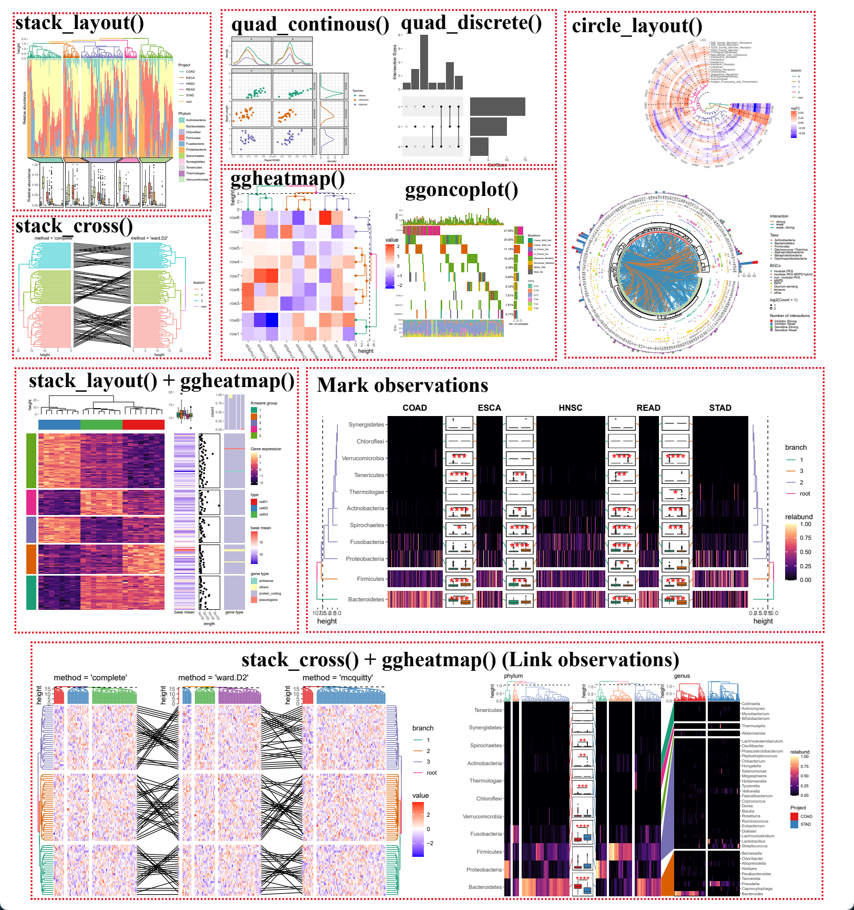

<!-- README.md is generated from README.Rmd. Please edit that file -->

# ggalign <a href="https://yunuuuu.github.io/ggalign/"></a>

<!-- badges: start -->

[](https://github.com/Yunuuuu/ggalign/actions/workflows/R-CMD-check.yaml)
[](https://app.codecov.io/gh/Yunuuuu/ggalign?branch=main)
[](https://CRAN.R-project.org/package=ggalign)
[](https://cran.r-project.org/package=ggalign)
<!-- badges: end -->

This package extends ggplot2 by providing advanced tools for aligning
and organizing multiple plots, particularly those that automatically
reorder observations, such as dendrogram. It offers fine control over
layout adjustment and plot annotations, enabling you to create complex,
publication-quality visualizations while still using the familiar
grammar of ggplot2.

## Why use `ggalign`?

`ggalign` focuses on aligning observations across multiple plots. It
leverages the `"number of observations"` in the
[vctrs](https://vctrs.r-lib.org/reference/vec_size.html) package or
`NROW()` function to maintain consistency in plot organization.

If you’ve ever struggled with aligning plots with self-contained
ordering (like dendrogram), or applying consistent grouping or ordering
across multiple plots (e.g., with k-means clustering), `ggalign` is
designed to make this easier. The package integrates seamlessly with
ggplot2, providing the flexibility to use its geoms, scales, and other
components for complex visualizations.

## Installation

You can install `ggalign` from `CRAN` using:

``` r
install.packages("ggalign")
```

Alternatively, install the development version from
[r-universe](https://yunuuuu.r-universe.dev/ggalign) with:

``` r
install.packages("ggalign",
    repos = c("https://yunuuuu.r-universe.dev", "https://cloud.r-project.org")
)
```

or from [GitHub](https://github.com/Yunuuuu/ggalign) with:

``` r
# install.packages("remotes")
remotes::install_github("Yunuuuu/ggalign")
```

## Learning ggalign

1.  The complete tutorial is available at:
    <https://yunuuuu.github.io/ggalign-book/>

2.  For the full reference documentation, visit:
    <https://yunuuuu.github.io/ggalign/>

## Examples



## Compare with other similar tools

<table class="table"><thead>
    <tr>
        <th colspan="2"></th>
        <th> <code>ggalign</code> </th>
        <th> <code>marsilea</code> </th>
        <th> <code>aplot</code> </th>
        <th> <code>ComplexHeatmap</code> </th>
    </tr></thead>
<tbody>
    <tr>
        <td colspan="2"> <strong>Language</strong> </td>
        <td>R</td>
        <td>Python</td>
        <td>R</td>
        <td>R</td>
    </tr>
    <tr>
        <td colspan="2"> <strong>User Interface</strong> </td>
        <td>Declarative</td>
        <td>Declarative</td>
        <td>Declarative+Functional</td>
        <td>Functional</td>
    </tr>
    <tr>
        <td colspan="2"> <strong>Plot System</strong> </td>
        <td>ggplot2 (Advanced plot system built on grid system)</td>
        <td>Matplotlib</td>
        <td>ggplot2 (Advanced plot system built on grid system)</td>
        <td>grid</td>
    </tr>
    <tr>
        <td colspan="2"> <strong>Focus</strong> </td>
        <td>Composable Visualization</td>
        <td>Composable Visualization</td>
        <td>Composable Visualization</td>
        <td>Heatmap</td>
    </tr>
    <tr>
        <td colspan="2"> <strong>StackLayout</strong> </td>
        <td>✅</td>
        <td>✅</td>
        <td>✅</td>
        <td>✅</td>
    </tr>
    <tr>
        <td colspan="2"> <strong>QuadLayout</strong> </td>
        <td>✅</td>
        <td>✅</td>
        <td>✅</td>
        <td>Heatmap Only (discrete variables)</td>
    </tr>
    <tr>
        <td colspan="2"> <strong>CircleLayout</strong> </td>
        <td>✅</td>
        <td>❌</td>
        <td>❌</td>
        <td>❌</td>
    </tr>
    <tr>
        <td rowspan="4"> <strong>Alignment</strong> </td>
        <td> <strong>One-to-One</strong> </td>
        <td>✅</td>
        <td>✅</td>
        <td>✅</td>
        <td>✅</td>
    </tr>
    <tr>
        <td> <strong>One-to-Many</strong>/<strong>Many-to-One</strong> </td>
        <td>✅</td>
        <td>❌</td>
        <td>❌</td>
        <td>❌</td>
    </tr>
    <tr>
        <td> <strong>Many-to-Many</strong> </td>
        <td>✅</td>
        <td>❌</td>
        <td>❌</td>
        <td>❌</td>
    </tr>
    <tr>
        <td> <strong>Crosswise</strong> </td>
        <td>✅</td>
        <td>❌</td>
        <td>❌</td>
        <td>❌</td>
    </tr>
    <tr>
        <td colspan="2"> <strong>Annotate observations</strong> </td>
        <td>✅</td>
        <td>❌</td>
        <td>❌</td>
        <td>✅</td>
    </tr>
    <tr>
        <td colspan="2"> <strong>Fully Compatible with ggplot2</strong> </td>
        <td>✅</td>
        <td>❌</td>
        <td>✅</td>
        <td>❌</td>
    </tr>
</tbody></table>

------------------------------------------------------------------------

| Specification                                | `ggalign`                                             | `marsilea`        | `aplot`                             | `ComplexHeatmap`                                                          |
|----------------------------------------------|-------------------------------------------------------|-------------------|-------------------------------------|---------------------------------------------------------------------------|
| **Data input**                               | Various, and can be easily extended                   | fixed             | Various, and can be easily extended | fixed                                                                     |
| **Plot Type**                                | Wide variety, provided by ggplot2                     | Many, but limited | ✅                                  | Many, but limited                                                         |
| **Reorder observations**                     | ✅                                                    | ✅                | ✅                                  | Heatmap Only                                                              |
| **Group observations into different panels** | ✅                                                    | ✅                | ❌                                  | Heatmap Only                                                              |
| **Clustering algorithm**                     | Kmeans,Hierarchical Clustering and arbitary algorithm | ❌                | ❌                                  | Kmeans,Hierarchical Clustering, but can provide clustering group directly |
| **Legends Creation**                         | Automatic                                             | Manual            | Automatic                           | Limited automatic, requires manual add                                    |
| **Legends Position**                         | Anywhere, can be controlled for a single plot         | ?                 | Anywhere                            | Four sides, can only be placed on one side at a time                      |
| **Scientific Color Palettes**                | Many                                                  | Limited           | Many                                | Limited                                                                   |
| **Dendrogram**                               | Tree from Both `hclust` or `ape`                      | `hclust` only     | ❌                                  | `hclust` only                                                             |
| **Tanglegram**                               | ✅                                                    | ❌                | ❌                                  | ❌                                                                        |
| **3D Heatmap**                               | ✅                                                    | ❌                | ❌                                  | ✅                                                                        |
| **Oncoplot**                                 | ✅                                                    | ✅                | ❌                                  | ✅                                                                        |
| **UpSet plot**                               | ✅                                                    | ✅                | ❌                                  | ✅                                                                        |

## Acknowledgements

I would like to express my sincere gratitude to the contributors of the
`ggplot2` project for providing a powerful and flexible framework for
data visualization in R. Their work laid the foundation for the
functionality and design of this package. I would also like to thank the
`patchwork` project, from which the core coding for the plot composer
was adapted. The `patchwork` library provided a useful mechanism for
combining and aligning plots, which was modified to suit the needs of
this package. Without the contributions of these open-source projects,
this package would not have been possible.

Additionally, I would like to extend my heartfelt thanks to
`@teunbrand`, who has fulfilled my numerous feature requests, and
assisted with the integration of new functions into ggplot2.
