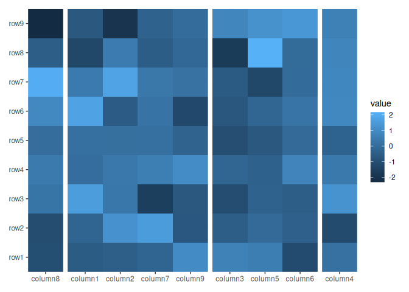
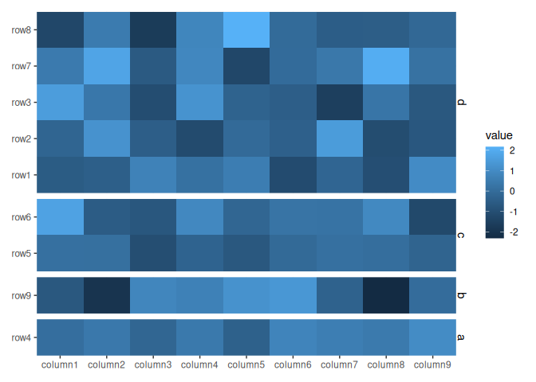
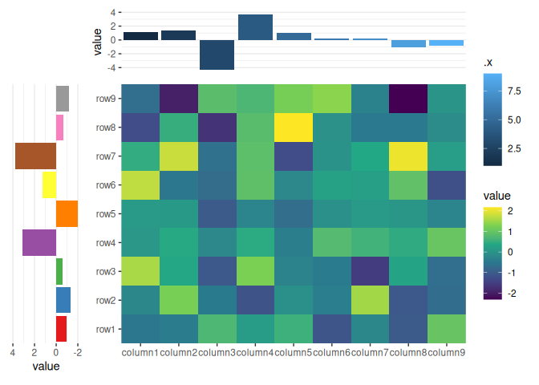
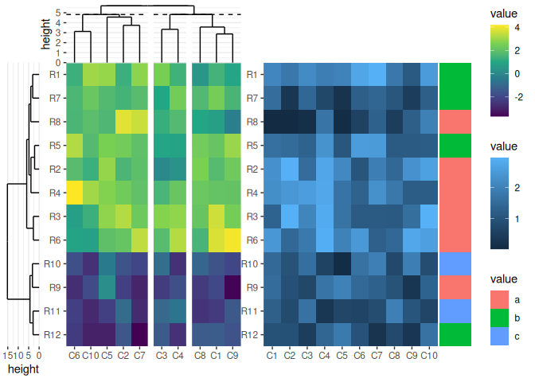
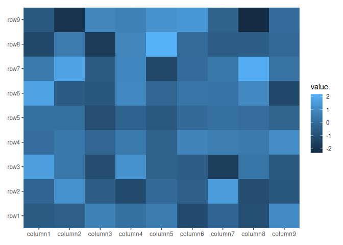

<!-- README.md is generated from README.Rmd. Please edit that file -->

## Installation

You can install the development version of `ggalign` from
[GitHub](https://github.com/) with:

``` r
# install.packages("remotes")
remotes::install_github("Yunuuuu/ggalign")
```

# ggalign

This package extends ggplot2 and provides numerous benefits for
organizing and arranging plots. It is specifically designed to align a
specific axis of multiple ggplot objects in a consistent order. This
functionality is particularly useful for plots that require manipulation
of data order. A common plot combination that can be effectively
organized using this package includes a dendrogram and a heatmap.

``` r
library(ggalign)
#> Loading required package: ggplot2
```

Let’s begin by creating some example data

``` r
set.seed(123)
small_mat <- matrix(rnorm(81), nrow = 9)
rownames(small_mat) <- paste0("row", seq_len(nrow(small_mat)))
colnames(small_mat) <- paste0("column", seq_len(ncol(small_mat)))
```

`ggalign` provids two layouts to build plots:

- `layout_heatmap`: heatmap layout, annotation can be put in “top”,
  “left”, “bottom” and “right”.
- `layout_stack`: align plots vertically or horizontally (You can also
  add layout_heatmap).

## `layout_heatmap`

`layout_heatmap` utilizes the grammar of graphics to construct the
heatmap and heatmap annotations. You can also use the alias `ggheatmap`.

``` r
ggheatmap(small_mat)
```


The data can be a numeric or character vector, a data frame, and any
other data which can be converted into a matrix. Simple vector will be
converted into a one column matrix. They will all converted into the
long formated data frame when drawing. The default mapping will use
`aes(.data$.x, .data$.y)`, but can be controlled using `mapping`
argument. The data in the underlying ggplot object contains following
columns:

- `.row_panel`: the row panel

- `.column_panel`: the column panel

- `.row_names` and `.column_names`: the row and column names of the
  original matrix (only applicable when names exist).

- `.row_index` and `.column_index`: the row and column index of the
  original matrix.

- `.x` and `.y`: the `x` and `y` coordinates

- `value`: the actual matrix value.

``` r
ggheatmap(letters)
```


``` r
ggheatmap(1:10)
```


``` r
ggheatmap(small_mat) + geom_point() + scale_fill_viridis_c()
```


You can turn off the default filling by setting `filling = FALSE`

``` r
ggheatmap(small_mat, filling = FALSE) +
  geom_text(aes(label = sprintf("%d * %d", .row_index, .column_index)))
```


Heatmap annotation works by adding additional information for heatmap
rows/columns. Heatmap annotations can be positioned at the `top`,
`left`, `bottom`, or `right` of the heatmap. This is referred to as the
active context in `ggheatmap`. we can add annotation with `align_*`
functions.

## `align_*`

> The `ggalign` package provides a range of `align_*` functions that
> enable control over the layout. Specifically, these functions allow
> for the manipulation of axis order in the layout, as well as
> partitioning along a single axis into multiple panels. Additionally,
> some of these functions have the capability to add plots.

Currently, there are four primary `align_*` functions: `align_group`,
`align_reorder`, `align_kmeans` and `align_dendro`.

### `align_group`

`align_group` just group along a layout axis into different panels.

By default, the `ggheatmap` function does not initialize any active
context, so if you want to add heatmap annotations, you need to use
`hmanno` to specify where the annotation should be added.

``` r
ggheatmap(small_mat) +
  hmanno("t") +
  align_group(sample(letters[1:4], ncol(small_mat), replace = TRUE))
```



By default, the facet strip text will be removed, you can override the
behaviour with `theme(strip.text = element_text())`.

``` r
ggheatmap(small_mat) +
  theme(strip.text = element_text()) +
  hmanno("l") +
  align_group(sample(letters[1:4], nrow(small_mat), replace = TRUE))
```



### `align_reorder`

`align_reorder` reorder heatmap rows/columns based on a summary
function.

``` r
ggheatmap(small_mat) +
  hmanno("l") +
  align_reorder(rowMeans)
```


Some `align_*` functions provide a `data` argument to specify the data.
This argument can accept a matrix, a data frame, or even a simple vector
that will be converted into a one-column matrix. If the `data` argument
is set to `NULL`, the function will use the layout data, as shown in the
previous example. Additionally, the `data` argument can also accept a
function (purrr-like lambda is also okay), which will be applied with
the layout data.

> It is important to note that all `align_*` function consider the rows
> as the observations. It means the `NROW` function must return the same
> number as the layout parallel axis. So for heatmap column annotation,
> the heatmap matrix will be transposed before using (If `data` is a
> function, it will be applied with the transposed matrix).

So even for top and bottom annotation, we can also use the `rowMeans` to
calculate the mean value for all columns.

``` r
ggheatmap(small_mat) +
  hmanno("t") +
  align_reorder(rowMeans)
```


### `align_kmeans`

`align_kmeans` group heatmap rows/columns by kmeans.

``` r
ggheatmap(small_mat) +
  hmanno("t") +
  align_kmeans(3L)
```


It is important to note that both `align_group` and `align_kmeans`
cannot do sub-groups. It means you cannot use them when there has been
any groups exist.

``` r
ggheatmap(small_mat) +
  hmanno("t") +
  align_group(sample(letters[1:4], ncol(small_mat), replace = TRUE)) +
  align_kmeans(3L)
#> Error in `align_kmeans()`:
#> ! `align_kmeans()` cannot do sub-split
#> ℹ group of heatmap column already exists
```

``` r
ggheatmap(small_mat) +
  hmanno("t") +
  align_kmeans(3L) +
  align_group(sample(letters[1:4], ncol(small_mat), replace = TRUE))
#> Error in `align_group()`:
#> ! `align_group()` cannot do sub-split
#> ℹ group of heatmap column already exists
```

### align_dendro

`align_dendro` class the addition of a dendrogram near the heatmap and
and it can also reorder the heatmap. This is primarily useful when
working with heatmap plots.

``` r
ggheatmap(small_mat) +
  hmanno("t") +
  align_dendro()
```


You can use the `distance` and `method` argument to control the
dendrogram builind proce.

``` r
ggheatmap(small_mat) +
  hmanno("t") +
  align_dendro(method = "ward.D2")
```


One useful function of dendrogram is to cut the columns/rows into
groups. You can specify `k` or `h`, which works the same with `cutree`.

``` r
ggheatmap(small_mat) +
  hmanno("t") +
  align_dendro(k = 3L)
```


In contrast to `align_group`, `align_kmeans`, and `align_reorder`,
`align_dendro` is capable of drawing plot components. Therefore, it has
a default `set_context` value of `TRUE`, which indicates whether to set
the active context to current Align object. we can directly add ggplot
elements after `align_dendro` function.

``` r
ggheatmap(small_mat) +
  hmanno("t") +
  align_dendro() +
  geom_point(aes(y = y))
```


`align_dendro` will create a default `node` data for the ggplot. See
`?dendrogram_data` for details. In addition, `edge` data has been added
into the `geom_segment` layer directly which was used to draw the
dendrogram tree. One useful variable in both `node` and edge `data` is
`branch` column, which corresponding to the `cutree` result.

``` r
ggheatmap(small_mat) +
  hmanno("t") +
  align_dendro(aes(color = branch), k = 3) +
  geom_point(aes(color = branch, y = y))
```


`align_dendro` is also capable of performing clustering between groups.
This means that you can use it even if there are already existing groups
present in the heatmap.

``` r
column_groups <- sample(letters[1:3], ncol(small_mat), replace = TRUE)
ggheatmap(small_mat) +
  hmanno("t") +
  align_group(column_groups) +
  align_dendro(aes(color = branch))
```


You can reorder the groups by setting `reorder_group = TRUE`.

``` r
ggheatmap(small_mat) +
  hmanno("t") +
  align_group(column_groups) +
  align_dendro(aes(color = branch), reorder_group = TRUE)
```


You can see the difference.

``` r
ggheatmap(small_mat) +
  hmanno("t") +
  align_group(column_groups) +
  align_dendro(aes(color = branch), reorder_group = TRUE) +
  hmanno("b") +
  align_dendro(aes(color = branch), reorder_group = FALSE)
```


It is important to understand that when `reorder_group = FALSE` is used,
the reordering of the heatmap occurs within each group. As long as the
ordering within each group remains the same, these two dendrograms can
be placed on the same axis of the heatmap. This is why adding a
dendrogram with`reorder_group = FALSE` behind a dendrogram with
`reorder_group = TRUE` is acceptable, as the second `align_dendro` will
follow the group ordering established by the first one. However, it is
not possible to add a dendrogram with `reorder_group = TRUE` behind a
dendrogram with `reorder_group = FALSE` because the second dendrogram
would not be able to conform to the grouping order followed by the first
dendrogram.

``` r
ggheatmap(small_mat) +
  hmanno("t") +
  align_group(column_groups) +
  align_dendro(aes(color = branch), reorder_group = FALSE) +
  hmanno("b") +
  align_dendro(aes(color = branch), reorder_group = TRUE)
#> Error in `align_dendro()`:
#> ! `align_dendro()` disrupt the previously established order of the
#>   heatmap x
```

> `ggalign` always prevent users from reordering the layout axis twice.

## `align_gg`

`align_gg` is similar to `ggplot` in that it initializes a `ggplot` data
and `mapping`. The data input can be a matrix, a data frame, or a simple
vector that will be converted into a one-column matrix, and can inherit
from the heatmap matrix. But for ggplot usage, matrix (including a
simple vector) data is converted into a long-format data frame, similar
to the process utilized in `ggheatmap`. But note that the long-format
data frame does not contain `.row_panel` or `.column_panel` column, as
annotations can only have one facet axis. In the case where the input
data is already a data frame, three additional columns-`.row_names`,
`.row_index`, and `.panel`—are added to the data frame.

You can also use `ggalign` which is an alias of `align_gg`.

``` r
ggheatmap(small_mat) +
  scale_fill_viridis_c(guide = "none") +
  hmanno("t") +
  align_dendro(aes(color = branch), k = 3) +
  ggalign(data = rowSums) +
  geom_bar(aes(y = value, fill = .panel), stat = "identity") +
  scale_fill_brewer(palette = "Dark2") +
  hmanno("l") +
  ggalign(aes(x = value), data = rowSums) +
  geom_bar(
    aes(y = .y, fill = factor(.y)),
    stat = "identity",
    orientation = "y"
  ) +
  scale_fill_brewer(palette = "Set1") +
  scale_x_reverse()
```


## Control size

The different ggplot objects were combined using the `patchwork`
package. Internally, the `build_patchwork` function was used to
construct and merge all the `ggplot` objects into a single `patchwork`
object.

`ggheatmap` has `width` and `height` to control the relative (you can
also provide a unit object) width and height of the heatmap body.
`hmanno` function have a `size` argument to control the relative width
(left and right annotation) or height (top and bottom annotation) of the
whole annotation. `anno_*` function has a `size` argument to control the
the relative width (left and right annotation) or height (top and bottom
annotation) of the single annotation in the whole annotation.

``` r
ggheatmap(small_mat) +
  scale_fill_viridis_c() +
  hmanno("t", size = unit(20, "mm")) +
  ggalign(data = rowSums) +
  geom_bar(aes(y = value, fill = .x), stat = "identity") +
  hmanno("l", size = 0.2) +
  ggalign(aes(x = value), data = rowSums) +
  geom_bar(
    aes(y = .y, fill = factor(.y)),
    stat = "identity",
    orientation = "y"
  ) +
  scale_fill_brewer(palette = "Set1", guide = "none") +
  scale_x_reverse()
```



## `layout_stack`

`layout_stack` put plots horizontally or vertically. You can also use
the alias `ggstack`.

``` r
set.seed(123)
mat1 <- matrix(rnorm(80, 2), 8, 10)
mat1 <- rbind(mat1, matrix(rnorm(40, -2), 4, 10))
rownames(mat1) <- paste0("R", 1:12)
colnames(mat1) <- paste0("C", 1:10)

mat2 <- matrix(runif(60, max = 3, min = 1), 6, 10)
mat2 <- rbind(mat2, matrix(runif(60, max = 2, min = 0), 6, 10))
rownames(mat2) <- paste0("R", 1:12)
colnames(mat2) <- paste0("C", 1:10)

le <- sample(letters[1:3], 12, replace = TRUE)
names(le) <- paste0("R", 1:12)

ind <- sample(12, 12)
mat1 <- mat1[ind, ]
mat2 <- mat2[ind, ]
le <- le[ind]
ht1 <- ggheatmap(mat1, width = 1) +
  scale_fill_viridis_c() +
  hmanno("t") +
  align_dendro(k = 3L) +
  scale_y_continuous(expand = expansion()) +
  hmanno(NULL)
ht2 <- ggheatmap(mat2, width = 1)
ggstack(mat1, rel_sizes = c(0.2, 1, 1)) +
  align_dendro(size = 0.2) +
  scale_x_reverse() +
  ht1 +
  ht2 +
  ggalign(data = le, size = 0.2) +
  geom_tile(aes(x = .column_index, fill = value)) +
  scale_x_continuous(name = NULL, labels = NULL, breaks = NULL) &
  theme(plot.margin = margin())
```



## restriction

The position scales and facets are partial support.

For position scales, you cannot set `limits`, `breaks`, `labels`, and
they are just ignored. `limits` cannot be touched, and the internal will
always reset it as the default. This is required to match the heatmap
and annotation limits. But you can set `labels` or `breaks` in
`ggheatmap()` function. See `xlabels/ylabels` and
`xlabels_nudge/ylabels_nudge`. All of these arguments should be provided
in the original order of the raw matrix.

``` r
ggheatmap(small_mat) + scale_x_continuous(limits = c(0, 0))
#> Scale for x is already present.
#> Adding another scale for x, which will replace the existing scale.
```


``` r
ggheatmap(small_mat) + scale_x_continuous(labels = "a")
#> Scale for x is already present.
#> Adding another scale for x, which will replace the existing scale.
```



``` r
ggheatmap(small_mat, xlabels = rep_len("AA", ncol(small_mat)))
```


When working with facets, manual configuration of panels using the
`facet_*` function is not possible since the internal will use
`facet_grid` to set the row/column groups controlled by heatmap
annotation. However, you can also provide `facet_grid` or `facet_null`
(if no panels) to control the non-layout arguments, like `labeller`.

``` r
ggheatmap(small_mat) +
  facet_grid(labeller = labeller(.panel = function(x) letters[as.integer(x)])) +
  hmanno("t") +
  align_dendro(aes(color = branch), k = 3) +
  geom_point(aes(y = y))
```


## Session information

``` r
sessionInfo()
#> R version 4.4.0 (2024-04-24)
#> Platform: x86_64-pc-linux-gnu
#> Running under: Ubuntu 24.04 LTS
#> 
#> Matrix products: default
#> BLAS/LAPACK: /usr/lib/x86_64-linux-gnu/libmkl_rt.so;  LAPACK version 3.8.0
#> 
#> locale:
#>  [1] LC_CTYPE=C.UTF-8       LC_NUMERIC=C           LC_TIME=C.UTF-8       
#>  [4] LC_COLLATE=C.UTF-8     LC_MONETARY=C.UTF-8    LC_MESSAGES=C.UTF-8   
#>  [7] LC_PAPER=C.UTF-8       LC_NAME=C              LC_ADDRESS=C          
#> [10] LC_TELEPHONE=C         LC_MEASUREMENT=C.UTF-8 LC_IDENTIFICATION=C   
#> 
#> time zone: Asia/Shanghai
#> tzcode source: system (glibc)
#> 
#> attached base packages:
#> [1] stats     graphics  grDevices utils     datasets  methods   base     
#> 
#> other attached packages:
#> [1] ggalign_0.0.1 ggplot2_3.5.1
#> 
#> loaded via a namespace (and not attached):
#>  [1] gtable_0.3.5         dplyr_1.1.4          compiler_4.4.0      
#>  [4] highr_0.11           tidyselect_1.2.1     tidyr_1.3.1         
#>  [7] scales_1.3.0         yaml_2.3.8           fastmap_1.2.0       
#> [10] ggh4x_0.2.8          R6_2.5.1             labeling_0.4.3      
#> [13] generics_0.1.3       patchwork_1.2.0.9000 knitr_1.47          
#> [16] tibble_3.2.1         munsell_0.5.1        pillar_1.9.0        
#> [19] RColorBrewer_1.1-3   rlang_1.1.4          utf8_1.2.4          
#> [22] xfun_0.45            viridisLite_0.4.2    cli_3.6.3           
#> [25] withr_3.0.0          magrittr_2.0.3       digest_0.6.36       
#> [28] grid_4.4.0           lifecycle_1.0.4      vctrs_0.6.5         
#> [31] evaluate_0.24.0      glue_1.7.0           farver_2.1.2        
#> [34] fansi_1.0.6          colorspace_2.1-0     rmarkdown_2.27      
#> [37] purrr_1.0.2          tools_4.4.0          pkgconfig_2.0.3     
#> [40] htmltools_0.5.8.1
```
