<!-- README.md is generated from README.Rmd. Please edit that file -->

# ggheat

<!-- badges: start -->

[](https://github.com/Yunuuuu/ggheat/actions/workflows/R-CMD-check.yaml)
<!-- badges: end -->

This package is a `ggplot2` extension for heatmap. It utilizes the
grammar of graphics to construct the heatmap and heatmap annotations.

## Installation

You can install the development version of ggheat from
[GitHub](https://github.com/) with:

``` r
# install.packages("devtools")
devtools::install_github("Yunuuuu/ggheat")
```

``` r
library(ggheat)
#> Loading required package: ggplot2
```

``` r
library(ggplot2)
```

Let’s begin by creating some example data

``` r
set.seed(123)
small_mat <- matrix(rnorm(81), nrow = 9)
```

## `ggheat`

The main function is `ggheat`, it’s just like the ggplot function, which
set the default data and mapping. Using `ggheat`, it is effortless to
create a simple Heatmap.

``` r
ggheat(small_mat)
```

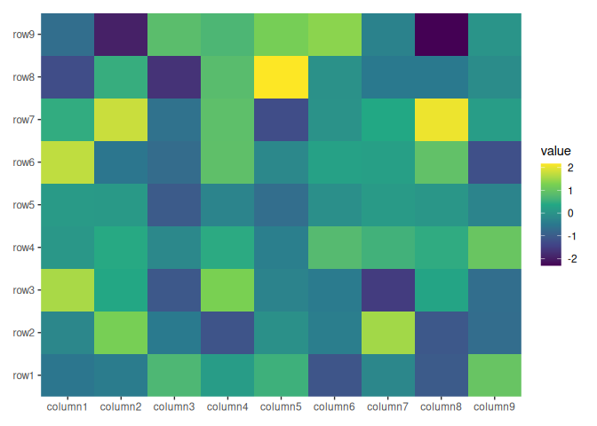

The data can be a numeric or character vector, a data frame, and any
other data which can be converted into a matrix. Simple vector will be
converted into a one column matrix. They will all converted into the
long formated data frame when drawing. The default mapping will use
`aes(.data$.x, .data$.y)`, you can use `mapping` argument to control it.
The data contains following columns:

- `.row_panel` or `.column_panl` instead of a column `.panel` since
  annotation can only have one facet axiss: the row panel

- `.column_panel`: the column panel

- `.row_names` and `.column_names`: the row and column names of the
  original matrix (only applicable when names exist).

- `.row_index` and `.column_index`: the row and column index of the
  original matrix.

- `.x` and `.y`: the `x` and `y` coordinates

- `value`: the actual matrix value.

You can then add all other ggplot2 elements like `geoms`, `scales` and
`facets`.

``` r
ggheat(letters)
```

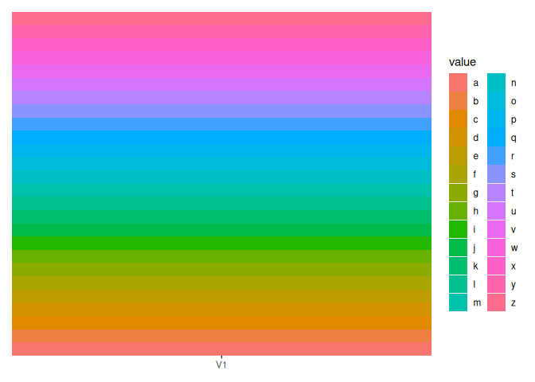

``` r
ggheat(1:10)
```

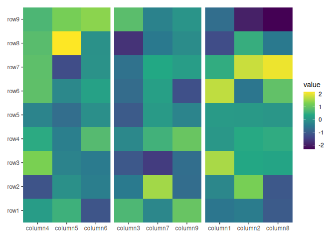

``` r
ggheat(small_mat) + scale_fill_viridis_c()
```


You can turn off the default filling by setting `filling = FALSE`

``` r
ggheat(small_mat, filling = FALSE) +
  scale_fill_viridis_c() +
  geom_text(aes(label = sprintf("%d * %d", .row_index, .column_index)))
```


The position scales and facets are partial support.

For position scales, you cannot set `limits`, `breaks`, `labels`, and
they are just ignored. `limits` cannot be touched, and the internal will
always reset it as the default. This is required by heatmap annotations.
But you can set `labels` or `breaks` in `ggheat()` function. See
`xlabels/ylabels` and `xlabels_nudge/ylabels_nudge`. All of these
arguments should be provided in the original order of the raw matrix.
Even if we’ll use heatmap annotation to reorder the heatmap
rows/columns.

``` r
ggheat(small_mat) + scale_x_continuous(limits = c(0, 0))
#> Scale for x is already present.
#> Adding another scale for x, which will replace the existing scale.
```

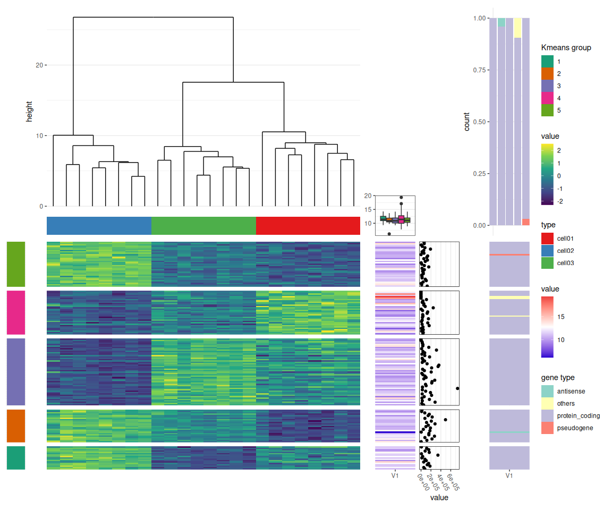

``` r
ggheat(small_mat) + scale_x_continuous(labels = "a")
#> Scale for x is already present.
#> Adding another scale for x, which will replace the existing scale.
```

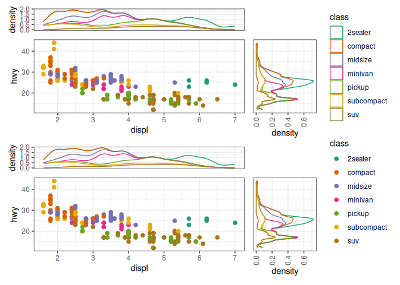

``` r
ggheat(small_mat, xlabels = rep_len("AA", ncol(small_mat)))
```

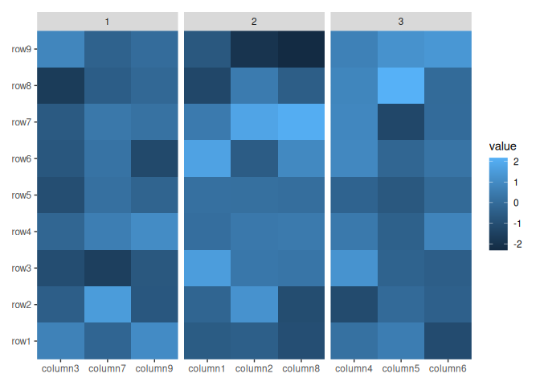

When working with facets, manual configuration of panels using the
`facet_*` function is not possible. However, the `facet_*` function can
still be used to control the `facet` looks.

To move forward with the subsequent procedures, it is necessary to
introduce the heatmap annotation first. Heatmap annotations are
essential components that contribute to the usability of a heatmap.

## `htanno`

`ggheat` offers two primary annotations: `htanno` and `gganno`.

`htanno` is a special annotation that can interact with the main
heatmap. It particularly allows for controlling the order of the main
heatmap or dividing the heatmap into sections based on rows/columns.

Heatmap annotations can be positioned at the `top`, `left`, `bottom`, or
`right` of the heatmap. This is referred to as the active component in
`ggheat`. Each annotation function provides a position argument to
control the placement of the annotation.

Currently, there are only two classes available for `htanno`:
`htanno_dendro` and `htanno_group`. The `htanno_dendro` class allows the
addition of a dendrogram near the heatmap. This is primarily useful when
working with heatmap plots. The primary purpose of a dendrogram is to
facilitate clustering and it can also reorder the heatmap.

``` r
ggheat(small_mat) + htanno_dendro(position = "top")
```

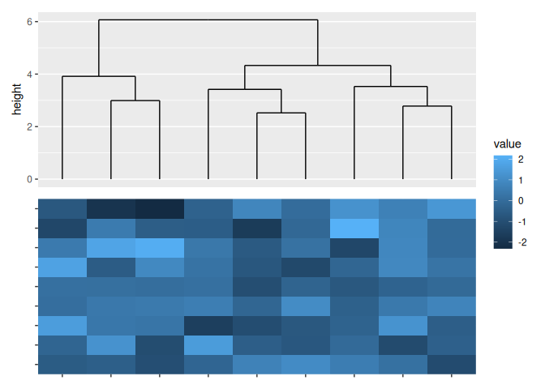

One another useful function of dendrogram is cut the columns/rows into
groups. You can specify `k` or `h`, which works the same with `cutree`.

``` r
ggheat(small_mat) + htanno_dendro(position = "top", k = 3)
```

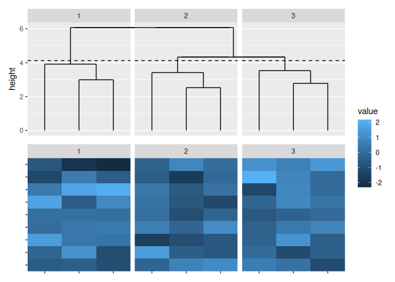

`htanno_dendro` will create a default `node` and `edge` data for the
ggplot. See `?dendrogram_data` for details. `node` data have been set as
the default data of the ggplot object, and `edge` data has been added
into the `geom_segment` layer which drawing the dendrogram tree, so you
cannot control the dendrogram by geom function, but you can control all
of the behaviour in `htanno_dendro`. The default mapping can be
controled via `mapping` argument, which is the same with `ggheat` and
all other annotation function. One useful variable in the data is
`branch` column, which corresponding to the `cutree` result.

``` r
ggheat(small_mat) + htanno_dendro(aes(color = branch), position = "top", k = 3)
```


All annotation functions include a `set_context` argument that
determines whether to set the active component when adding the
annotation. This argument requires a boolean value of length `2`. If a
scalar value is provided, it will be recycled. The first value
determines whether the active component is set to the annotation
position. The second value will determine whether the active component
of annotation list in this position should be set as current annotation.
In the code mentioned above, the active component of the heatmap is set
to the `top` and the active component of the top annotation list will be
set to the dendrogram plot since `htanno_dendro` has a default
`set_context` value of `TRUE`. So you can easily add more `geoms` with
the default `node` data.

``` r
ggheat(small_mat) +
  htanno_dendro(aes(color = branch), position = "top", k = 3) +
  geom_point(aes(y = y))
```

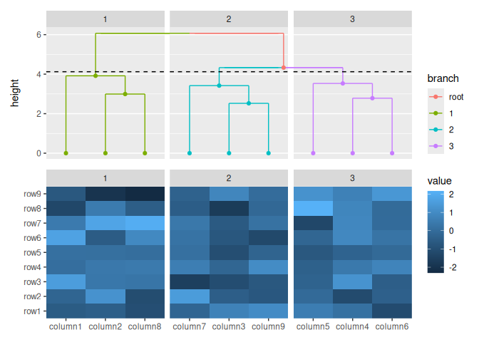

By default, all annotation functions automatically create a default
mapping for the axis parallel to the heatmap. Therefore, when utilizing
these functions, you only need to provide the mapping for the other
axis.

As mentioned above, `facet_*` function won’t work, since the internal
will always use the row/column groups controlled by heatmap annotation,
but you can also provide `facet_grid` or `facet_null` (if no panels) to
control the non-layout arguments, like `labeller`.

``` r
ggheat(small_mat) +
  htanno_dendro(aes(color = branch), position = "top", k = 3) +
  geom_point(aes(y = y)) +
  facet_grid(labeller = labeller(.panel = function(x) letters[as.integer(x)]))
```

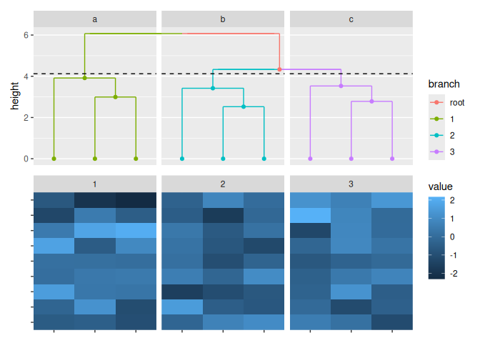

Each annotation function includes a `data` argument to specify the
annotation data. This argument can accept a matrix, a data frame, or
even a simple vector that will be converted into a one-column matrix. If
the `data` argument is set to `NULL`, the function will use the heatmap
matrix, as shown in the previous examples. Additionally, the data
argument can also accept a function(purrr-like lambda is also okay), to
manipulate the heatmap matrix. It is important to note that all
annotations consider the rows as the observations. It means the `NROW`
function must return the same number as the heatmap parallel axis. So
for column annotation, the heatmap will be transposed before using (If
`data` is a function, it will be applied with the transposed matrix).

Since `htanno_dendro` has set the active context for the `top` position,
we can add more annotations without specifying the position arguments.

``` r
ggheat(small_mat) +
  htanno_dendro(aes(color = branch), position = "top", k = 3) +
  # since the heatmap matrix will be transposed before using, we should to
  # rowSums to calculate the column sums of the original matrix
  gganno(data = rowSums) +
  # again: the default mapping will be made for the parallel axis of heatmap
  geom_bar(aes(y = value, fill = .panel), stat = "identity") +
  scale_fill_brewer(palette = "Dark2")
```

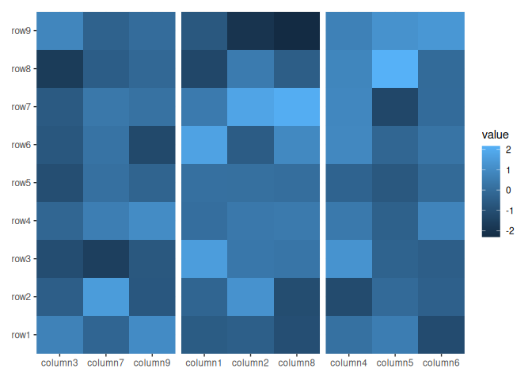

## `gganno`

`gganno` is similar to `ggheat` and `ggplot` in that it initializes a
`ggplot` data and `mapping`. Before drawing, specific operations are
performed to prepare for the visualization. The matrix (including a
simple vector) is converted into a long-format data frame, similar to
the process utilized in ggheat. However, the data frame does not contain
.row_panel or .column_panel columns, as annotations can only have one
facet axis. In the case where the input data is already a data frame,
three additional columns-`.row_names`, `.row_index`, and `.panel`—are
added to the data frame.

Let’s add more annotations to different position. Since we want to add
annotation into another position, we must specify the `position`
argument or we can add an `active` object (we also provide `activate`
and `deactivate` for function call foramt).

``` r
ggheat(small_mat) +
  htanno_dendro(aes(color = branch), position = "top", k = 3) +
  gganno(data = rowSums) +
  geom_bar(aes(y = value, fill = .panel), stat = "identity") +
  scale_fill_brewer(palette = "Dark2") +
  active("left") +
  gganno(aes(x = value), data = rowSums) +
  geom_bar(
    aes(y = .y, fill = factor(.y)),
    stat = "identity",
    orientation = "y"
  ) +
  scale_x_reverse()
```

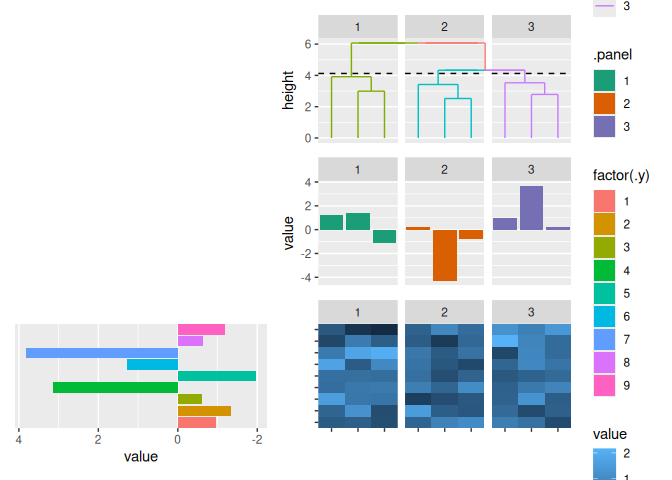

For convenient, we also provide `gganno_*` function for 4 positions.

``` r
ggheat(small_mat) +
  gganno_top(aes(y = value), data = rowSums) +
  geom_bar(stat = "identity", aes(fill = factor(.panel))) +
  scale_fill_brewer(name = NULL, palette = "Dark2") +
  gganno_left(aes(x = value), data = rowSums) +
  geom_bar(
    aes(y = .y, fill = factor(.y)),
    stat = "identity",
    orientation = "y"
  ) +
  scale_x_reverse()
```

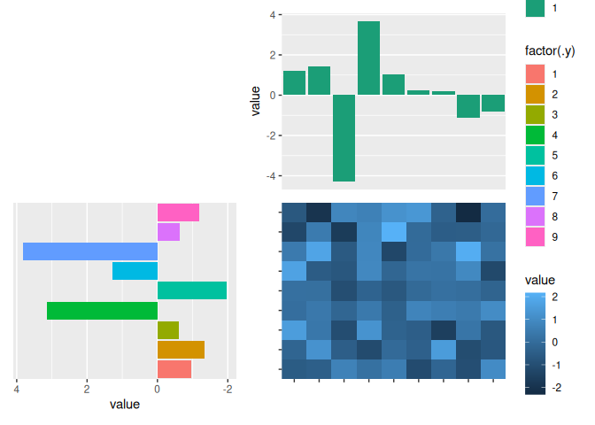

## `htanno_group`

Another `htanno_group` class provides convenient way to split heatmap
`rows/columns` into different panels with a group vairables. It won’t
draw anything.

``` r
ggheat(small_mat) +
  htanno_group(
    sample(letters[1:3], nrow(small_mat), replace = TRUE),
    position = "left"
  )
```

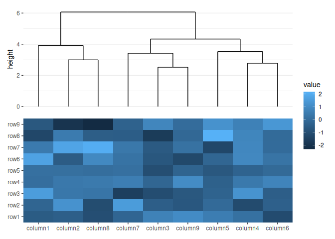

You can combine `htanno_dendro` and `htanno_group` in different axis.

``` r
ggheat(small_mat) +
  htanno_dendro(aes(color = branch), position = "top", k = 3) +
  htanno_group(
    sample(letters[1:3], nrow(small_mat), replace = TRUE),
    position = "left"
  ) +
  gganno_left(aes(x = value), data = rowSums) +
  geom_bar(
    aes(y = .y, fill = factor(.y)),
    stat = "identity",
    orientation = "y"
  ) +
  scale_x_reverse()
```


But you cannot mix them in the same axis.

``` r
ggheat(small_mat) +
  htanno_dendro(aes(color = branch), position = "top", k = 3) +
  htanno_group(sample(letters[1:3], ncol(small_mat), replace = TRUE))
#> Error in `htanno_group()`:
#> ! `htanno_group()` cannot do sub-split
#> ℹ group of heatmap column already exists
```

I’ll add support of sub-clustering for `htanno_dendro`.

## Control size

The different ggplot objects were combined using the `patchwork`
package. Internally, the `ggheat_build` function was used to construct
and merge all the `ggplot` objects into a single `patchwork` object.

`ggheat` has `width` and `height` to control the relative (you can also
provide a unit object) width and height. All annotation function have a
`size` argument to control the relative width (left and right
annotation) or height (top and bottom annotation).

``` r
pp <- ggheat(small_mat) +
  scale_fill_viridis_c() +
  gganno_top(data = rowSums, size = unit(10, "mm")) +
  geom_bar(aes(y = value, fill = .x), stat = "identity") +
  gganno_left(aes(x = value), data = rowSums, size = 0.5) +
  geom_bar(
    aes(y = .y, fill = factor(.y)),
    stat = "identity",
    orientation = "y"
  ) +
  scale_x_reverse()
pp
```


Internally, the `ggheat_build` function was used to construct and merge
all the `ggplot` objects into a single `patchwork` object. But usually
there is no need to manually perform this combination since much of the
arguments can be controlled within the `ggheat` function and the
annotation functions.

``` r
class(ggheat_build(pp))
#> [1] "patchwork" "gg"        "ggplot"
```

## Session information

``` r
sessionInfo()
#> R version 4.4.0 (2024-04-24)
#> Platform: x86_64-pc-linux-gnu
#> Running under: Ubuntu 24.04 LTS
#> 
#> Matrix products: default
#> BLAS/LAPACK: /usr/lib/x86_64-linux-gnu/libmkl_rt.so;  LAPACK version 3.8.0
#> 
#> locale:
#>  [1] LC_CTYPE=C.UTF-8       LC_NUMERIC=C           LC_TIME=C.UTF-8       
#>  [4] LC_COLLATE=C.UTF-8     LC_MONETARY=C.UTF-8    LC_MESSAGES=C.UTF-8   
#>  [7] LC_PAPER=C.UTF-8       LC_NAME=C              LC_ADDRESS=C          
#> [10] LC_TELEPHONE=C         LC_MEASUREMENT=C.UTF-8 LC_IDENTIFICATION=C   
#> 
#> time zone: Asia/Shanghai
#> tzcode source: system (glibc)
#> 
#> attached base packages:
#> [1] stats     graphics  grDevices utils     datasets  methods   base     
#> 
#> other attached packages:
#> [1] ggheat_0.0.0.9000 ggplot2_3.5.1    
#> 
#> loaded via a namespace (and not attached):
#>  [1] gtable_0.3.5       dplyr_1.1.4        compiler_4.4.0     highr_0.11        
#>  [5] tidyselect_1.2.1   tidyr_1.3.1        scales_1.3.0       yaml_2.3.8        
#>  [9] fastmap_1.2.0      ggh4x_0.2.8        R6_2.5.1           labeling_0.4.3    
#> [13] generics_0.1.3     patchwork_1.2.0    knitr_1.47         tibble_3.2.1      
#> [17] munsell_0.5.1      pillar_1.9.0       RColorBrewer_1.1-3 rlang_1.1.4       
#> [21] utf8_1.2.4         xfun_0.45          viridisLite_0.4.2  cli_3.6.3         
#> [25] withr_3.0.0        magrittr_2.0.3     digest_0.6.36      grid_4.4.0        
#> [29] lifecycle_1.0.4    vctrs_0.6.5        evaluate_0.24.0    glue_1.7.0        
#> [33] farver_2.1.2       fansi_1.0.6        colorspace_2.1-0   rmarkdown_2.27    
#> [37] purrr_1.0.2        tools_4.4.0        pkgconfig_2.0.3    htmltools_0.5.8.1
```
