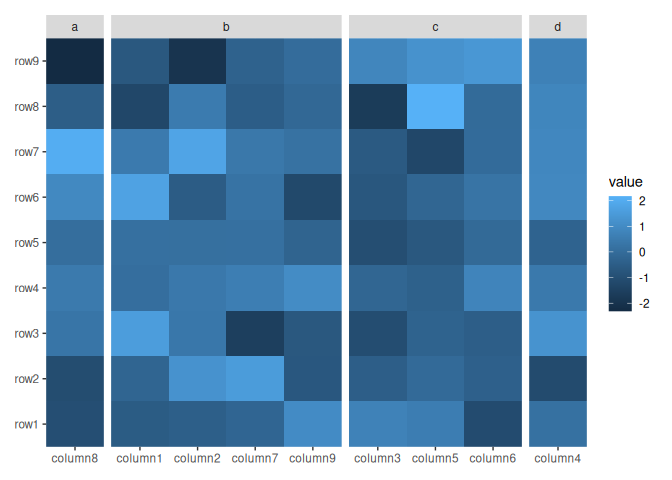
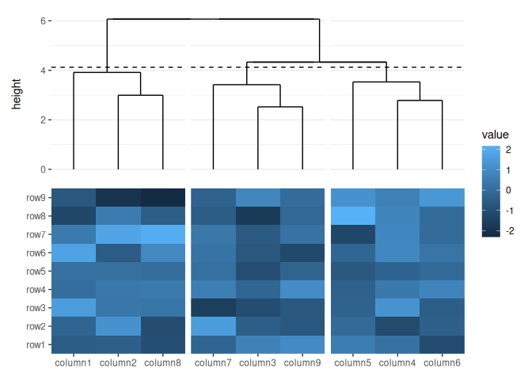
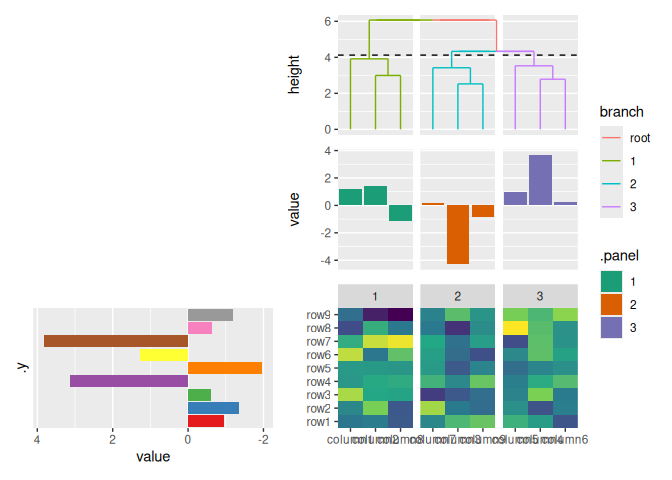
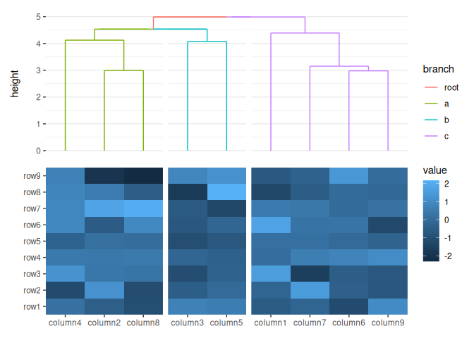
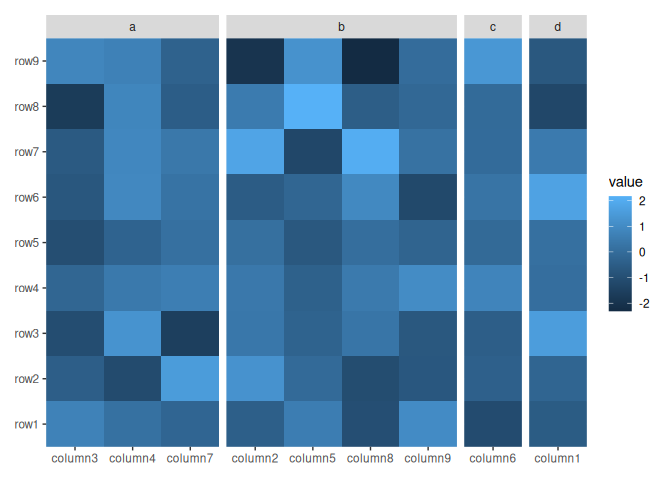
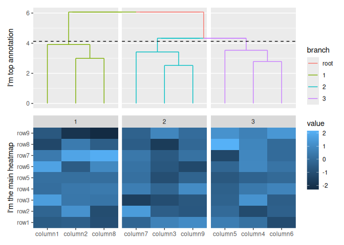
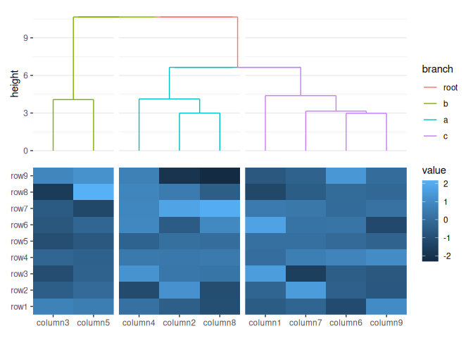
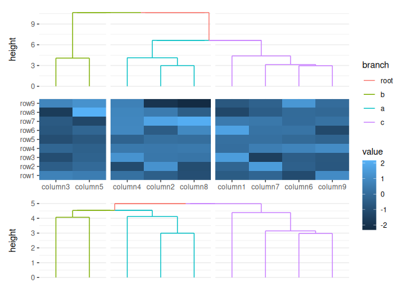
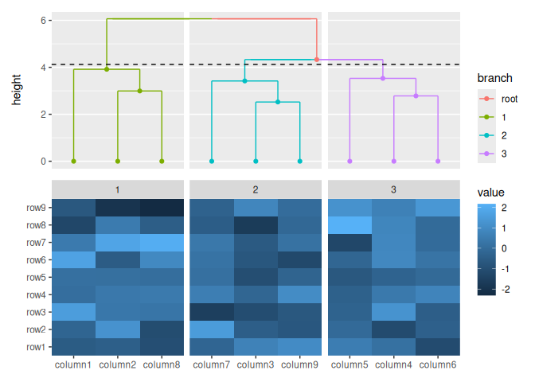

<!-- README.md is generated from README.Rmd. Please edit that file -->

# ggheat

<!-- badges: start -->

[](https://github.com/Yunuuuu/ggheat/actions/workflows/R-CMD-check.yaml)
<!-- badges: end -->

This package is a `ggplot2` extension for heatmap. It utilizes the
grammar of graphics to construct the heatmap and heatmap annotations.

## Installation

You can install the development version of ggheat from
[GitHub](https://github.com/) with:

``` r
# install.packages("devtools")
pak::pkg_install("Yunuuuu/ggheat")
```

``` r
library(ggheat)
#> Loading required package: ggplot2
```

Let’s begin by creating some example data

``` r
set.seed(123)
small_mat <- matrix(rnorm(81), nrow = 9)
rownames(small_mat) <- paste0("row", seq_len(nrow(small_mat)))
colnames(small_mat) <- paste0("column", seq_len(ncol(small_mat)))
```

## `ggheat`

The core function in the `ggheat` package is `ggheat`, which sets the
default data and mapping for the heatmap. Creating a simple heatmap is
effortless with the `ggheat` function

``` r
ggheat(small_mat)
```


The data can be a numeric or character vector, a data frame, and any
other data which can be converted into a matrix. Simple vector will be
converted into a one column matrix. They will all converted into the
long formated data frame when drawing. The default mapping will use
`aes(.data$.x, .data$.y)`, but can be controlled using `mapping`
argument. The data in the underlying ggplot object contains following
columns:

- `.row_panel` or `.column_panl` instead of a column `.panel` since
  annotation can only have one facet axiss: the row panel

- `.column_panel`: the column panel

- `.row_names` and `.column_names`: the row and column names of the
  original matrix (only applicable when names exist).

- `.row_index` and `.column_index`: the row and column index of the
  original matrix.

- `.x` and `.y`: the `x` and `y` coordinates

- `value`: the actual matrix value.

``` r
ggheat(letters)
```


``` r
ggheat(1:10)
```


You can then add all other ggplot2 elements like `geoms`, `scales` and
`facets`.

``` r
ggheat(small_mat) + geom_point() + scale_fill_viridis_c()
```


You can turn off the default filling by setting `filling = FALSE`

``` r
ggheat(small_mat, filling = FALSE) +
  scale_fill_viridis_c() +
  geom_text(aes(label = sprintf("%d * %d", .row_index, .column_index)))
```


Heatmap annotation works by adding additional information for heatmap
rows/columns. Heatmap annotations can be positioned at the `top`,
`left`, `bottom`, or `right` of the heatmap. This is referred to as the
active context in `ggheat`.

> `ggheat` offers two primary annotations: `htanno` and `gganno`.

## `htanno`

`htanno` is a special annotation that can interact with the main
heatmap. It particularly allows for controlling the order of the main
heatmap or dividing the heatmap into sections based on rows/columns.
Some of them can also adding plot.

Currently, there are four sub-classes of `htanno`: `htanno_group`,
`htanno_reorder`, `htanno_kmeans` and `htanno_dendro`.

### `htanno_group`

`htanno_group` just group heatmap rows/columns into different panels.

By default, the `ggheat` function does not initialize any active
context, so if you want to add annotations, you need to specify the
`position` argument. We can omit it if there is any active context in
the heatmap (we’ll introduce how to set the active context after for
details).

``` r
ggheat(small_mat) +
  htanno_group(
    sample(letters[1:4], ncol(small_mat), replace = TRUE),
    position = "top"
  )
```



``` r
ggheat(small_mat) +
  htanno_group(
    sample(letters[1:4], nrow(small_mat), replace = TRUE),
    position = "left"
  )
```


### `htanno_reorder`

`htanno_reorder` reorder heatmap rows/columns based on a summary
function.

``` r
ggheat(small_mat) + htanno_reorder(rowMeans, position = "left")
```


Some annotation function includes a `data` argument to specify the
annotation data. This argument can accept a matrix, a data frame, or
even a simple vector that will be converted into a one-column matrix. If
the `data` argument is set to `NULL`, the function will use the heatmap
matrix, as shown in the previous example. Additionally, the `data`
argument can also accept a function (purrr-like lambda is also okay),
which will be applied with the heatmap matrix.

> It is important to note that all annotations consider the rows as the
> observations. It means the `NROW` function must return the same number
> as the heatmap parallel axis. So for column annotation, the heatmap
> will be transposed before using (If `data` is a function, it will be
> applied with the transposed matrix).

So even for top and bottom annotation, we can also use the `rowMeans` to
calculate the mean value for all columns.

``` r
ggheat(small_mat) + htanno_reorder(rowMeans, position = "top")
```


### `htanno_kmeans`

`htanno_kmeans` group heatmap rows/columns by kmeans.

``` r
ggheat(small_mat) + htanno_kmeans(3L, position = "t")
```


It is important to note that both `htanno_group` and `htanno_kmeans`
cannot do sub-groups. It means when there has been any groups exist. You
cannot use them

``` r
ggheat(small_mat) +
  htanno_group(
    sample(letters[1:4], ncol(small_mat), replace = TRUE),
    position = "t"
  ) +
  htanno_kmeans(3L)
#> Error in `htanno_kmeans()`:
#> ! `htann_kmeans()` cannot do sub-split
#> ℹ group of heatmap column already exists
```

``` r
ggheat(small_mat) +
  htanno_kmeans(3L, position = "t") +
  htanno_group(sample(letters[1:4], ncol(small_mat), replace = TRUE))
#> Error in `htanno_group()`:
#> ! `htanno_group()` cannot do sub-split
#> ℹ group of heatmap column already exists
```

You may have noticed that the `htanno_group` function does not
explicitly set the `position` argument after `htanno_kmeans`. When
adding an annotation, we can set the active context using the
`set_context` argument. This argument requires a boolean value of length
`2`. It will be recycled for a single value.

- The first value determines whether the active context is set to the
  annotation `position`.
- The second value will determine whether the active context of the
  annotation list in this position should be set as current annotation.

In the case of `htanno_kmeans`, the default `set_context` value is
`c(TRUE, FALSE)`, implying that the active context is already set by
`htanno_kmeans`.

### htanno_dendro

`htanno_dendro` class the addition of a dendrogram near the heatmap and
and it can also reorder the heatmap. This is primarily useful when
working with heatmap plots.

``` r
ggheat(small_mat) + htanno_dendro(position = "top")
```


You can use the `distance` and `method` argument to control the
dendrogram builind proce.

``` r
ggheat(small_mat) + htanno_dendro(position = "top", method = "ward.D2")
```


One useful function of dendrogram is to cut the columns/rows into
groups. You can specify `k` or `h`, which works the same with `cutree`.

``` r
ggheat(small_mat) + htanno_dendro(position = "top", k = 3)
```


In contrast to `htanno_group`, `htanno_kmeans`, and `htanno_reorder`,
`htanno_dendro` is capable of drawing plot components. Therefore, it has
a default `set_context` value of `c(TRUE, TRUE)`, we can directly add
ggplot elements after `htanno_dendro` function.

``` r
ggheat(small_mat) +
  htanno_dendro(position = "top") +
  geom_point(aes(y = y))
```


`htanno_dendro` will create a default `node` data for the ggplot. See
`?dendrogram_data` for details. In addition, `edge` data has been added
into the `geom_segment` layer directly which was used to draw the
dendrogram tree. One useful variable in both `node` and edge `data` is
`branch` column, which corresponding to the `cutree` result.

``` r
ggheat(small_mat) +
  htanno_dendro(aes(color = branch), position = "top", k = 3) +
  geom_point(aes(color = branch, y = y))
```


`htanno_dendro` is also capable of performing clustering between groups.
This means that you can use it even if there are already existing groups
present in the heatmap.

``` r
column_groups <- sample(letters[1:3], ncol(small_mat), replace = TRUE)
ggheat(small_mat) +
  htanno_group(column_groups, "t") +
  htanno_dendro(aes(color = branch))
```


You can reorder the groups by setting `reorder_group = TRUE`.

``` r
ggheat(small_mat) +
  htanno_group(column_groups, "t") +
  htanno_dendro(aes(color = branch), reorder_group = TRUE)
```


You can see the difference.

``` r
ggheat(small_mat) +
  htanno_group(column_groups, "t") +
  htanno_dendro(aes(color = branch), reorder_group = TRUE) +
  htanno_dendro(aes(color = branch), reorder_group = FALSE, position = "b")
```



It is important to understand that when `reorder_group = FALSE` is used,
the reordering of the heatmap occurs within each group. As long as the
ordering within each group remains the same, these two dendrograms can
be placed on the same axis of the heatmap. This is why adding a
dendrogram with`reorder_group = FALSE` behind a dendrogram with
`reorder_group = TRUE` is acceptable, as the second `htanno_dendro` will
follow the group ordering established by the first one. However, it is
not possible to add a dendrogram with `reorder_group = TRUE` behind a
dendrogram with `reorder_group = FALSE` because the second dendrogram
would not be able to conform to the grouping order followed by the first
dendrogram.

``` r
ggheat(small_mat) +
  htanno_group(column_groups, "t") +
  htanno_dendro(aes(color = branch), reorder_group = FALSE) +
  htanno_dendro(aes(color = branch), reorder_group = TRUE, position = "b")
#> Error in `htanno_dendro()`:
#> ! `htanno_dendro()` disrupt the previously established order of the
#>   heatmap column
```

> `ggheat` always prevent user from reordering the heatmap twice.

## `gganno`

`gganno` is similar to `ggheat` and `ggplot` in that it initializes a
`ggplot` data and `mapping`. The data input can be a matrix, a data
frame, or a simple vector that will be converted into a one-column
matrix, and can inherit from the heatmap matrix. But for ggplot usage,
matrix (including a simple vector) data is converted into a long-format
data frame, similar to the process utilized in `ggheat`. But note that
the long-format data frame does not contain `.row_panel` or
`.column_panel` column, as annotations can only have one facet axis. In
the case where the input data is already a data frame, three additional
columns-`.row_names`, `.row_index`, and `.panel`—are added to the data
frame.

Let’s add more annotations to different position. Since we want to add
annotation into another position, we must specify the `position`
argument or we can add an `active` object (we also provide `activate`
and `deactivate` for function call foramt).

For convenient, we also provide `gganno_*` function for 4 positions.

``` r
ggheat(small_mat) +
  scale_fill_viridis_c(guide = "none") +
  htanno_dendro(aes(color = branch), position = "top", k = 3) +
  gganno(data = rowSums) +
  geom_bar(aes(y = value, fill = .panel), stat = "identity") +
  scale_fill_brewer(palette = "Dark2") +
  gganno_left(aes(x = value), data = rowSums) +
  geom_bar(
    aes(y = .y, fill = factor(.y)),
    stat = "identity",
    orientation = "y"
  ) +
  scale_fill_brewer(palette = "Set1", guide = "none") +
  scale_x_reverse()
```



## Control size

The different ggplot objects were combined using the `patchwork`
package. Internally, the `ggheat_build` function was used to construct
and merge all the `ggplot` objects into a single `patchwork` object.

`ggheat` has `width` and `height` to control the relative (you can also
provide a unit object) width and height. All annotation function have a
`size` argument to control the relative width (left and right
annotation) or height (top and bottom annotation).

``` r
ggheat(small_mat) +
  scale_fill_viridis_c() +
  gganno_top(data = rowSums, size = unit(10, "mm")) +
  geom_bar(aes(y = value, fill = .x), stat = "identity") +
  gganno_left(aes(x = value), data = rowSums, size = 0.5) +
  geom_bar(
    aes(y = .y, fill = factor(.y)),
    stat = "identity",
    orientation = "y"
  ) +
  scale_fill_brewer(palette = "Set1", guide = "none") +
  scale_x_reverse()
```



## active

An alternative method to modify the active context is by adding an
`active` object.

``` r
ggheat(small_mat) +
  active("top") +
  htanno_group(sample(letters[1:4], ncol(small_mat), replace = TRUE))
```



``` r
ggheat(small_mat) +
  active("top") +
  htanno_dendro(aes(color = branch), k = 3) +
  ylab("I'm top annotation") +
  active(NULL) +
  ylab("I'm the main heatmap")
```



## restriction

The position scales and facets are partial support.

For position scales, you cannot set `limits`, `breaks`, `labels`, and
they are just ignored. `limits` cannot be touched, and the internal will
always reset it as the default. This is required to match the heatmap
and annotation limits. But you can set `labels` or `breaks` in
`ggheat()` function. See `xlabels/ylabels` and
`xlabels_nudge/ylabels_nudge`. All of these arguments should be provided
in the original order of the raw matrix. Even if we use heatmap
annotation to reorder the heatmap rows/columns.

``` r
ggheat(small_mat) + scale_x_continuous(limits = c(0, 0))
#> Scale for x is already present.
#> Adding another scale for x, which will replace the existing scale.
```



``` r
ggheat(small_mat) + scale_x_continuous(labels = "a")
#> Scale for x is already present.
#> Adding another scale for x, which will replace the existing scale.
```



``` r
ggheat(small_mat, xlabels = rep_len("AA", ncol(small_mat)))
```


When working with facets, manual configuration of panels using the
`facet_*` function is not possible since the internal will use
`facet_grid` to set the row/column groups controlled by heatmap
annotation. However, you can also provide `facet_grid` or `facet_null`
(if no panels) to control the non-layout arguments, like `labeller`.

``` r
ggheat(small_mat) +
  facet_grid(labeller = labeller(.panel = function(x) letters[as.integer(x)])) +
  htanno_dendro(aes(color = branch), position = "top", k = 3) +
  geom_point(aes(y = y))
```



## Session information

``` r
sessionInfo()
#> R version 4.4.0 (2024-04-24)
#> Platform: x86_64-pc-linux-gnu
#> Running under: Ubuntu 24.04 LTS
#> 
#> Matrix products: default
#> BLAS/LAPACK: /usr/lib/x86_64-linux-gnu/libmkl_rt.so;  LAPACK version 3.8.0
#> 
#> locale:
#>  [1] LC_CTYPE=C.UTF-8       LC_NUMERIC=C           LC_TIME=C.UTF-8       
#>  [4] LC_COLLATE=C.UTF-8     LC_MONETARY=C.UTF-8    LC_MESSAGES=C.UTF-8   
#>  [7] LC_PAPER=C.UTF-8       LC_NAME=C              LC_ADDRESS=C          
#> [10] LC_TELEPHONE=C         LC_MEASUREMENT=C.UTF-8 LC_IDENTIFICATION=C   
#> 
#> time zone: Asia/Shanghai
#> tzcode source: system (glibc)
#> 
#> attached base packages:
#> [1] stats     graphics  grDevices utils     datasets  methods   base     
#> 
#> other attached packages:
#> [1] ggheat_0.0.1  ggplot2_3.5.1
#> 
#> loaded via a namespace (and not attached):
#>  [1] gtable_0.3.5       dplyr_1.1.4        compiler_4.4.0     highr_0.11        
#>  [5] tidyselect_1.2.1   tidyr_1.3.1        scales_1.3.0       yaml_2.3.8        
#>  [9] fastmap_1.2.0      ggh4x_0.2.8        R6_2.5.1           labeling_0.4.3    
#> [13] generics_0.1.3     patchwork_1.2.0    knitr_1.47         tibble_3.2.1      
#> [17] munsell_0.5.1      pillar_1.9.0       RColorBrewer_1.1-3 rlang_1.1.4       
#> [21] utf8_1.2.4         xfun_0.45          viridisLite_0.4.2  cli_3.6.3         
#> [25] withr_3.0.0        magrittr_2.0.3     digest_0.6.36      grid_4.4.0        
#> [29] lifecycle_1.0.4    vctrs_0.6.5        evaluate_0.24.0    glue_1.7.0        
#> [33] farver_2.1.2       fansi_1.0.6        colorspace_2.1-0   rmarkdown_2.27    
#> [37] purrr_1.0.2        tools_4.4.0        pkgconfig_2.0.3    htmltools_0.5.8.1
```
