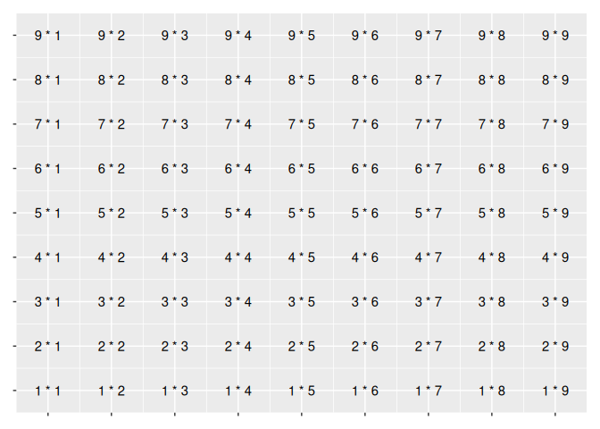

<!-- README.md is generated from README.Rmd. Please edit that file -->

# ggalign <a href="https://yunuuuu.github.io/ggalign/"></a>

<!-- badges: start -->

[](https://github.com/Yunuuuu/ggalign/actions/workflows/R-CMD-check.yaml)
[](https://app.codecov.io/gh/Yunuuuu/ggalign?branch=main)
[](https://CRAN.R-project.org/package=ggalign)
<!-- badges: end -->

This package extends ggplot2 by providing advanced tools for aligning
and organizing multiple plots, particularly those that automatically
reorder observations, such as dendrogram. It offers fine control over
layout adjustment and plot annotations, enabling you to create complex,
publication-quality visualizations while still using the familiar
grammar of ggplot2.

## Why use `ggalign`?

`ggalign` focuses on aligning observations across multiple plots. It
leverages the `"number of observations"` in the
[vctrs](https://vctrs.r-lib.org/reference/vec_size.html) package or
`NROW()` function to maintain consistency in plot organization.

If you’ve ever struggled with aligning plots with self-contained
ordering (like dendrogram), or applying consistent grouping or ordering
across multiple plots (e.g., with k-means clustering), `ggalign` is
designed to make this easier. The package integrates seamlessly with
ggplot2, providing the flexibility to use its geoms, scales, and other
components for complex visualizations.

## Installation

You can install `ggalign` from `CRAN` using:

``` r
install.packages("ggalign")
```

Alternatively, install the development version from
[r-universe](https://yunuuuu.r-universe.dev/ggalign) with:

``` r
install.packages("ggalign",
    repos = c("https://yunuuuu.r-universe.dev", "https://cloud.r-project.org")
)
```

or from [GitHub](https://github.com/Yunuuuu/ggalign) with:

``` r
# install.packages("remotes")
remotes::install_github("Yunuuuu/ggalign")
```

## Getting Started

The usage of `ggalign` is simple if you’re familiar with `ggplot2`
syntax, the typical workflow includes:

- Initialize the layout using `quad_layout()` (`ggheatmap()`/`ggside()`)
  or `stack_layout()` (`ggstack()`).
- Customize the layout with:
  - `align_group()`: Group observations into panel with a group
    variable.
  - `align_kmeans()`: Group observations into panel by kmeans.
  - `align_order()`: Reorder layout observations based on statistical
    weights or by manually specifying the observation index.
  - `align_dendro()`: Reorder or Group layout based on hierarchical
    clustering.
- Adding plots with `ggalign()` or `ggfree()`, and then layer additional
  ggplot2 elements such as geoms, stats, or scales.

For documents of the release version, please see
<https://yunuuuu.github.io/ggalign/>, for documents of the development
version, please see <https://yunuuuu.github.io/ggalign/dev/>.

## Basic example

Below, we’ll walk through a basic example of using `ggalign` to create a
heatmap with a `dendrogram`.

``` r
library(ggalign)
#> Loading required package: ggplot2
```

``` r
set.seed(123)
small_mat <- matrix(rnorm(72), nrow = 9)
rownames(small_mat) <- paste0("row", seq_len(nrow(small_mat)))
colnames(small_mat) <- paste0("column", seq_len(ncol(small_mat)))

# initialize the heatmap layout, we can regard it as a normal ggplot object
my_heatplot <- ggheatmap(small_mat) +
    # we can directly modify geoms, scales and other ggplot2 components
    scale_fill_viridis_c() +
    # add annotation in the top
    anno_top() +
    # in the top annotation, we add a dendrogram, and split observations into 3 groups
    align_dendro(aes(color = branch), k = 3) +
    # in the dendrogram we add a point geom
    geom_point(aes(color = branch, y = y)) +
    # change color mapping for the dendrogram
    scale_color_brewer(palette = "Dark2")
my_heatplot
#> → heatmap built with `geom_tile()`
```


Marginal plots can also be created with similar syntax:

``` r
my_sideplot <- ggside(mpg, aes(displ, hwy, colour = class)) -
    # set default theme for all plots in the layout
    plot_theme(theme_bw()) +
    geom_point(size = 2) +
    # add top annotation
    anno_top(size = 0.3) -
    # set default theme for the top annotation
    plot_theme(theme_no_axes("tb")) +
    # add a plot in the top annotation
    ggfree() +
    geom_density(aes(displ, y = after_stat(density), colour = class), position = "stack") +
    anno_right(size = 0.3) -
    # set default theme for the right annotation
    plot_theme(theme_no_axes("lr")) +
    # add a plot in the right annotation
    ggfree() +
    geom_density(aes(x = after_stat(density), hwy, colour = class),
        position = "stack"
    ) +
    theme(axis.text.x = element_text(angle = 90, vjust = .5)) &
    scale_color_brewer(palette = "Dark2")
my_sideplot
```



## Compare with other ggplot2 heatmap extension

`ggalign` offers advantages over extensions like
[ggheatmap](https://github.com/XiaoLuo-boy/ggheatmap) by providing full
compatibility with `ggplot2`. With `ggalign`, you can:

- Seamlessly integrate ggplot2 `geoms`, `stats`, `scales` et al. into
  your layouts.
- Align dendrograms even in facetted plots.
- Easily create complex layouts, including multiple heatmaps arranged
  vertically or horizontally.

## Compare with ComplexHeatmap

### Pros

- Full integration with the `ggplot2` ecosystem.
- Heatmap annotation axes and legends are automatically generated.
- Dendrogram can be easily customized and colored.
- Flexible control over plot size and spacing.
- Can easily align with other `ggplot2` plots by panel area.
- Can easily extend for other clustering algorithm, or annotation plot.

### Cons

Fewer Built-In Annotations: May require additional coding for specific
annotations or customization compared to the extensive built-in
annotation function in
[ComplexHeatmap](https://github.com/jokergoo/ComplexHeatmap).

## More Complex Examples

Here are some more advanced visualizations using `ggalign`:


