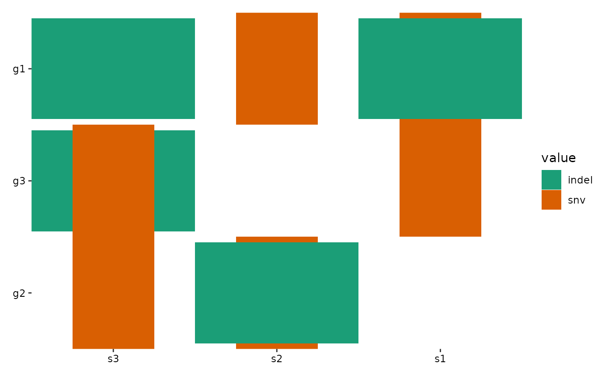
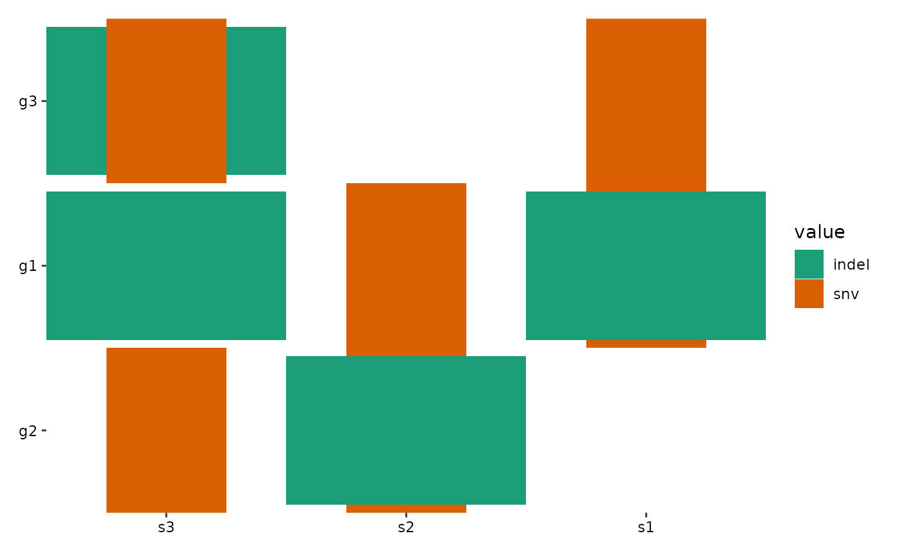
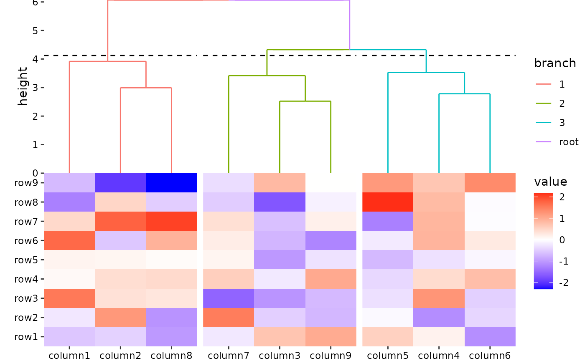

# FAQ

``` r
library(ggalign)
#> Loading required package: ggplot2
#> ========================================
#> ggalign version 1.2.0.9000
#> 
#> If you use it in published research, please cite: 
#> Peng, Y.; Jiang, S.; Song, Y.; et al. ggalign: Bridging the Grammar of Graphics and Biological Multilayered Complexity. Advanced Science. 2025. doi:10.1002/advs.202507799
#> ========================================
```

## How to arrange ggalign objects with other ggplot2 or grid objects?

[`align_plots()`](https://yunuuuu.github.io/ggalign/reference/alignpatches.md)
function can arrange the ggplot2 objects, and it can also accept objects
from `ggalign`, `ComplexHeatmap`, `pheatmap` directly. It behaves
similar with `pathwork::wrap_plots()`, but it cannot add tags (the “A”,
“B”, “C”, “D” in the top-left corner) — I prefer to add tags manually
using Inkscape or Illustrator.

If you wish to use other packages to arrange your plots, you can use the
[`ggalignGrob()`](https://yunuuuu.github.io/ggalign/reference/ggalignGrob.md)
function to convert `ggalign` objects into a grob. This allows you to
arrange them alongside other plots or annotations using `patchwork`,
`cowplot`, or `ggpubr`. However, note that in this case, the plot panels
of the `ggalign` **Layout** object won’t be aligned with the ggplot2
plot panel.

## How to customize the gene ordering in ggoncoplot function?

To manually define the row (gene) and column (sample) order in
[`ggoncoplot()`](https://yunuuuu.github.io/ggalign/reference/ggoncoplot.md),
you first need to disable the automatic ordering applied by
[`ggoncoplot()`](https://yunuuuu.github.io/ggalign/reference/ggoncoplot.md).
Then, you can use the
[`align_order()`](https://yunuuuu.github.io/ggalign/reference/align_order.md)
function to specify the desired arrangement.

``` r
# Sample data
mut_mat <- read.table(
    textConnection(
        "s1,s2,s3
         snv;indel,snv,indel
         ,snv;indel,snv
         snv,,indel;snv"
    ),
    row.names = NULL,
    header = TRUE,
    sep = ",",
    stringsAsFactors = FALSE
)
rownames(mut_mat) <- c("g1", "g2", "g3")
mut_mat <- as.matrix(mut_mat)

# Example 1: Manually order rows using numeric indices
ggoncoplot(
    mut_mat,
    map_width = c(snv = 0.5),
    map_height = c(indel = 0.9),
    reorder_row = FALSE
) +
    scale_fill_brewer(palette = "Dark2", na.translate = FALSE) +
    # Use anno_left() or anno_right() for row ordering; for columns, use anno_top() or anno_bottom()
    anno_left() +
    align_order(c(2, 3, 1)) # Orders rows as g2, g3, g1
```



``` r
# Example 2: Manually order rows using row names
ggoncoplot(
    mut_mat,
    map_width = c(snv = 0.5),
    map_height = c(indel = 0.9),
    reorder_row = FALSE
) +
    scale_fill_brewer(palette = "Dark2", na.translate = FALSE) +
    anno_left() +
    align_order(c("g2", "g1", "g3")) # Orders rows as g2, g1, g3
```


For row ordering, you can use either numeric indices (e.g., c(2, 3, 1))
or character names (e.g., c(“g2”, “g1”, “g3”)) if your matrix has row
names. For column ordering, simply replace
[`anno_left()`](https://yunuuuu.github.io/ggalign/reference/quad_active.md)
with
[`anno_top()`](https://yunuuuu.github.io/ggalign/reference/quad_active.md)
or
[`anno_bottom()`](https://yunuuuu.github.io/ggalign/reference/quad_active.md)
and specify the sample order in
[`align_order()`](https://yunuuuu.github.io/ggalign/reference/align_order.md).
Note the ordering specified is from bottom to the top or from left to
the right which following the ggplot2 coordinates.

For certain objects related to
[`ggoncoplot()`](https://yunuuuu.github.io/ggalign/reference/ggoncoplot.md),
the
[`fortify_matrix()`](https://yunuuuu.github.io/ggalign/reference/fortify_matrix.md)
method includes a `genes` argument that allows manual specification of
gene order (character only). You can define this argument directly
within
[`ggoncoplot()`](https://yunuuuu.github.io/ggalign/reference/ggoncoplot.md),
Currently, the supported objects for oncoplot-specific usage include:

- `maftools`
- a matrix wrapped with `tune(matrix, "oncoplot")`

The primary reason we must wrap a standard matrix with
[`tune()`](https://yunuuuu.github.io/ggalign/reference/tune.md) is that
[`fortify_matrix()`](https://yunuuuu.github.io/ggalign/reference/fortify_matrix.md)
cannot distinguish between the default matrix method and the one
specifically intended for
[`ggoncoplot()`](https://yunuuuu.github.io/ggalign/reference/ggoncoplot.md).

``` r
ggoncoplot(
    tune(mut_mat, "oncoplot"),
    genes = c("g2", "g1", "g3"), # Orders rows as g2, g1, g3
    map_width = c(snv = 0.5),
    map_height = c(indel = 0.9),
    reorder_row = FALSE
) +
    scale_fill_brewer(palette = "Dark2", na.translate = FALSE) 
```



## Can I change the default data for all geoms?

All function in `ggalign` requires specific data formats for its
operations. If you need to transform or filter data for individual
`geoms`, you can use the `data` argument within each `geom`. However, if
you have multiple `geoms` and want a consistent transformation applied
across all, you can utilize the
[`scheme_data()`](https://yunuuuu.github.io/ggalign/reference/scheme_data.md)
function which allows you to transform the default data for all additive
geoms.

## Why are there spaces after setting all `plot.margin` to zero?

By default, ggalign doesn’t add spaces between plots. If you notice
spaces, they are likely due to:

- Plot margins within individual plots.
- Scale expansion automatically added by ggplot2.

You can resolve this by removing the scale expansion and adjusting the
margins in the theme:

``` r
set.seed(123)
small_mat <- matrix(rnorm(81), nrow = 9)
rownames(small_mat) <- paste0("row", seq_len(nrow(small_mat)))
colnames(small_mat) <- paste0("column", seq_len(ncol(small_mat)))
```

``` r
ggheatmap(small_mat) +
    anno_top() +
    align_dendro(aes(color = branch), k = 3L) +
    scale_y_continuous(expand = expansion()) &
    theme(plot.margin = margin())
#> → heatmap built with `geom_tile()`
```



## Why can’t I add two dendrograms with different `reorder` settings?

> Note: We always prevent users from reordering layout direction twice.

When `reorder_group = FALSE` is used, reordering of the heatmap occurs
within each group. As long as the ordering within each group remains
consistent, these two dendrograms can be placed on the same axis of the
heatmap.

``` r
set.seed(123)
small_mat <- matrix(rnorm(81), nrow = 9)
rownames(small_mat) <- paste0("row", seq_len(nrow(small_mat)))
colnames(small_mat) <- paste0("column", seq_len(ncol(small_mat)))
```

Let’s assume that panels represents the group for each observation and
index represents the ordered index of the observations.

In the code provided, panels is initialized as ungrouped and index as
unordered:

``` r
panels <- NULL
index <- NULL
```

``` r
set.seed(2L)
group <- sample(letters[1:3], ncol(small_mat), replace = TRUE)
h <- ggheatmap(small_mat) +
    anno_top() +
    align_group(group)
```

When we add a dendrogram with `reorder_group = FALSE`; this’ll do
something like this (Since `reorder_group = FALSE`, the `panels` won’t
be changed):

``` r
h1 <- h + align_dendro(reorder_group = FALSE, merge_dendrogram = TRUE)
# always remember dendrogram will initialize the index, here, we extract the
# index from the underlying dendrogram
index <- stats::order.dendrogram(ggalign_stat(h1, "top", 2L))
```

However, if a dendrogram with `reorder_group = TRUE` is then added, it
will reorder the panels, so the underlying index will be changed:

``` r
h2 <- h + align_dendro(reorder_group = TRUE, merge_dendrogram = TRUE)
new_index <- stats::order.dendrogram(ggalign_stat(h2, "top", 2L))
all(index == new_index)
#> [1] FALSE
```

To prevent reordering of the axis twice, we ensure that the `new_index`
matches the `index` (if `index` is not NULL). This is done to maintain
consistency and prevent conflicts in the ordering of the heatmap.

## Session information

``` r
sessionInfo()
#> R version 4.5.2 (2025-10-31)
#> Platform: x86_64-pc-linux-gnu
#> Running under: Ubuntu 24.04.3 LTS
#> 
#> Matrix products: default
#> BLAS:   /usr/lib/x86_64-linux-gnu/openblas-pthread/libblas.so.3 
#> LAPACK: /usr/lib/x86_64-linux-gnu/openblas-pthread/libopenblasp-r0.3.26.so;  LAPACK version 3.12.0
#> 
#> locale:
#>  [1] LC_CTYPE=C.UTF-8       LC_NUMERIC=C           LC_TIME=C.UTF-8       
#>  [4] LC_COLLATE=C.UTF-8     LC_MONETARY=C.UTF-8    LC_MESSAGES=C.UTF-8   
#>  [7] LC_PAPER=C.UTF-8       LC_NAME=C              LC_ADDRESS=C          
#> [10] LC_TELEPHONE=C         LC_MEASUREMENT=C.UTF-8 LC_IDENTIFICATION=C   
#> 
#> time zone: UTC
#> tzcode source: system (glibc)
#> 
#> attached base packages:
#> [1] stats     graphics  grDevices utils     datasets  methods   base     
#> 
#> other attached packages:
#> [1] ggalign_1.2.0.9000 ggplot2_4.0.1     
#> 
#> loaded via a namespace (and not attached):
#>  [1] vctrs_0.6.5        cli_3.6.5          knitr_1.51         rlang_1.1.7       
#>  [5] xfun_0.55          S7_0.2.1           textshaping_1.0.4  jsonlite_2.0.0    
#>  [9] labeling_0.4.3     glue_1.8.0         htmltools_0.5.9    ragg_1.5.0        
#> [13] sass_0.4.10        scales_1.4.0       rmarkdown_2.30     grid_4.5.2        
#> [17] evaluate_1.0.5     jquerylib_0.1.4    fastmap_1.2.0      yaml_2.3.12       
#> [21] lifecycle_1.0.5    compiler_4.5.2     RColorBrewer_1.1-3 fs_1.6.6          
#> [25] systemfonts_1.3.1  farver_2.1.2       digest_0.6.39      R6_2.6.1          
#> [29] pillar_1.11.1      bslib_0.9.0        withr_3.0.2        tools_4.5.2       
#> [33] gtable_0.3.6       pkgdown_2.2.0      cachem_1.1.0       desc_1.4.3
```
