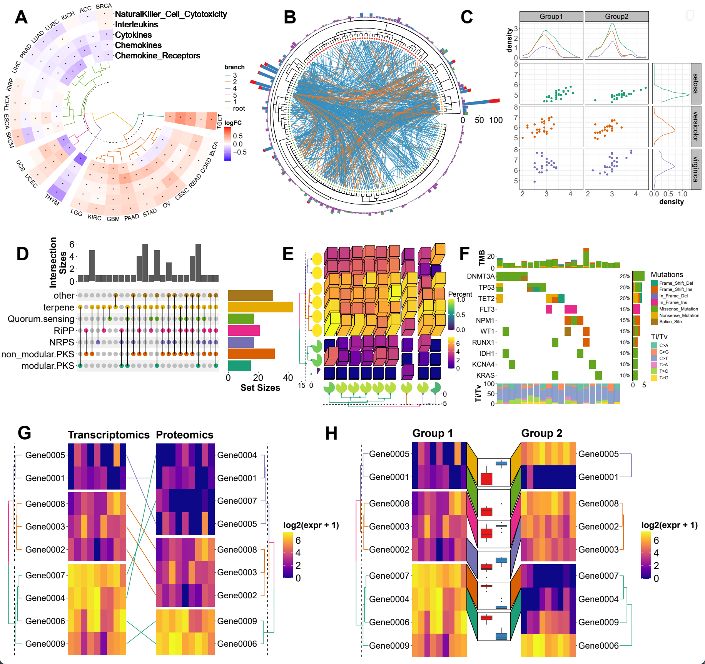

# ggalign

The `ggalign` package provides an integrative framework for composable
visualization, enabling the construction of complex multi-plot
layouts—including insets, circular arrangements, and multi-panel
compositions. Built on the grammar of graphics, it introduces tools to
align, stack, and nest plots, making it easy to link related views,
overlay clustering results, or highlight shared patterns. Designed for
high-dimensional data contexts such as genomics, transcriptomics, and
microbiome studies, it simplifies the creation of richly annotated,
publication-ready figures from diverse visual components.

## Why use `ggalign`?

`ggalign` focuses on aligning observations across multiple plots. If
you’ve ever struggled with aligning plots with self-contained ordering
(like dendrogram), or applying consistent grouping or ordering across
multiple plots (e.g., with k-means clustering), `ggalign` is designed to
make this easier. The package integrates seamlessly with ggplot2,
providing the flexibility to use its geoms, scales, and other components
for complex visualizations.

## Installation

You can install `ggalign` from `CRAN` using:

``` r
install.packages("ggalign")
```

Alternatively, install the development version from
[r-universe](https://yunuuuu.r-universe.dev/ggalign) with:

``` r
install.packages("ggalign",
    repos = c("https://yunuuuu.r-universe.dev", "https://cloud.r-project.org")
)
```

or from [GitHub](https://github.com/Yunuuuu/ggalign) with:

``` r
# install.packages("remotes")
remotes::install_github("Yunuuuu/ggalign")
```

## Design features


## Examples



## Comparison with other composable visualization tools

|                                   |                                 | `ggalign`                                           | `marsilea`                          | `ComplexHeatmap`                  |
|-----------------------------------|---------------------------------|-----------------------------------------------------|-------------------------------------|-----------------------------------|
| **Language**                      |                                 | R                                                   | Python                              | R                                 |
| **User Interface**                |                                 | Declarative                                         | Declarative                         | Functional                        |
| **Plot System**                   |                                 | ggplot2 (Advanced plot system built on grid system) | Matplotlib                          | grid                              |
| **Focus**                         |                                 | General-purpose composable visualization            | Grid-based composable visualization | Heatmap                           |
| **StackLayout**                   |                                 | ✅                                                  | ✅                                  | ✅                                |
| **QuadLayout**                    |                                 | ✅                                                  | ✅                                  | Heatmap Only (discrete variables) |
| **CircleLayout**                  |                                 | ✅                                                  | ❌                                  | ❌                                |
| **Relationship**                  | **One-to-One**                  | ✅                                                  | ✅                                  | ✅                                |
|                                   | **One-to-Many**/**Many-to-One** | ✅                                                  | ❌                                  | ❌                                |
|                                   | **Many-to-Many**                | ✅                                                  | ❌                                  | ❌                                |
|                                   | **Crosswise**                   | ✅                                                  | ❌                                  | ❌                                |
| **Annotate observations**         |                                 | ✅                                                  | ❌                                  | ✅                                |
| **Fully Compatible with ggplot2** |                                 | ✅                                                  | ❌                                  | ❌                                |

## Feature and specification comparison

| Specification                                | `ggalign`                                             | `marsilea`    | `ComplexHeatmap`                                      |
|----------------------------------------------|-------------------------------------------------------|---------------|-------------------------------------------------------|
| **Reorder observations**                     | ✅                                                    | ✅            | Heatmap Only                                          |
| **Group observations into different panels** | ✅                                                    | ✅            | Heatmap Only                                          |
| **Clustering algorithm**                     | Kmeans,Hierarchical Clustering and arbitary algorithm | ❌            | Kmeans,Hierarchical Clustering and arbitary algorithm |
| **Legends Creation**                         | Automatic                                             | Automatic     | Limited automatic, requires manual add                |
| **Legends Position**                         | Anywhere; independently controllable per plot         | Anywhere      | Fixed to one of four sides                            |
| **Dendrogram**                               | Tree from both `hclust` or `ape`                      | `hclust` only | `hclust` only                                         |
| **Tanglegram**                               | ✅                                                    | ❌            | ❌                                                    |
| **3D Heatmap**                               | ✅                                                    | ❌            | ✅                                                    |
| **Oncoplot**                                 | ✅                                                    | ✅            | ✅                                                    |
| **UpSet plot**                               | ✅                                                    | ✅            | ✅                                                    |

## Altmetric scores

## Acknowledgements

I would like to express my sincere gratitude to the contributors of the
`ggplot2` project for providing a powerful and flexible framework for
data visualization in R. Their work laid the foundation for the
functionality and design of this package. I would also like to thank the
`patchwork` project, from which the core coding for the plot composer
was adapted. The `patchwork` library provided a useful mechanism for
combining and aligning plots, which was modified to suit the needs of
this package. Without the contributions of these open-source projects,
this package would not have been possible.

Additionally, I would like to extend my heartfelt thanks to
`@teunbrand`, who has fulfilled my numerous feature requests, and
assisted with the integration of new functions into ggplot2.
